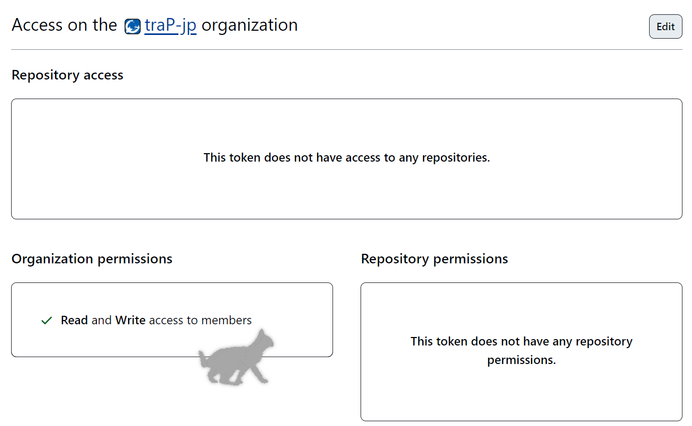

# members

Organization メンバー・チーム管理用 Terraform

Terraform v1系を使うこと

ディレクトリ構成

```txt
.
├── README.md
├── h23s.tf # ハッカソンのチーム。毎回ファイルを作っている
├── h23w.tf
├── main.tf # providerの設定やteams.tf, members.tfを取り込んでの実行
├── members.tf # orgのメンバー管理
├── modules # モジュール
│   ├── members # orgのメンバー
│   │   ├── main.tf
│   │   ├── provider.tf
│   │   └── variables.tf
│   └── teams # orgのチームとそのメンバー
│       ├── main.tf
│       ├── output.tf
│       ├── provider.tf
│       └── variables.tf
└── teams.tf # 親子関係の無いチーム
```

## 使い方

Organizationのメンバーを変更したり、チームを変更したりするために使います。

1. 変更を加える
2. mainブランチへのプルリクエストを出すと、GitHub Actionsで以下の処理が行われる
   1. `terraform validate` 文法が正しいかを調べる
   2. `terraform fmt` フォーマットが正しいかを調べる
   3. `terraform plan`  どのような変更が加えられたのかを調べる
   4. 3の結果をPRにコメントする
3. 2が成功したらadminがレビューする
4. approveされたらマージする
5. マージされると、GitHub Actionsで`terraform apply`が実行され、変更が反映される

Organizationのadminかどうかは手動で管理してください。

具体例を書きます。基本的にはリポジトリルートのファイルのみ編集すれば十分です。

### Organizationにメンバーを追加・削除したい

リポジトリルートの[`members.tf`](./members.tf)を編集します。`members`の配列の中にGitHubのIDを追加してください。アルファベット順にするとわかりやすいです。

### 親子関係の無いチームを1つ追加したい

[`teams.tf`](./teams.tf)を編集します。`teams`の中に以下のようなデータを追加します。

```tf
"team-name" = {
  members = ["aaa", "bbb"] # チームのメンバーのGitHub ID
  maintainers = ["ccc", "ddd"] # チームのメンテナーGitHub ID
  description = "チームの説明"
  secret = false # 公開されているチームかどうか。デフォルトはfalse(公開)
}
```

打ち間違いすると動かないので、コピペがおすすめです。

そもそもチームそのものはOrganizationの外からは見えないので、このOrganizationでsecretにする意味はあまりない気がします。

### 親子関係のある複数のチームを追加したい

チームの数にもよりますが、新しくファイルを作るとわかりやすいと思います。ハッカソンで使うことを想定しています。
[`h23s.tf`](./h23s.tf)などを参考にしてください。

下の例は、`xxx-team`というチームの下に`xxx_01`と`xxx_02`というチームを作る設定です。

```tf
module "xxx_parent_team" {
  source = "./modules/teams"

  team_name   = "xxx-team" # 親チーム名
  members     = local.xxx_parent.members
  maintainers = local.xxx_parent.maintainers
  description = "親チームの説明"
}

module "xxx_children_teams" {
  for_each = local.xxx_children
  source   = "./modules/teams"

  team_name   = each.key
  members     = each.value.members
  maintainers = each.value.maintainers
  description = contains(keys(each.value), "description") ? each.value.description : ""

  parent_id = module.xxx_parent_team.team_id
}

locals {
  xxx_parent = {
    members = ["aaa", "bbb", "ccc", "ddd"] # 親チームのメンバーのGitHub ID
    maintainers = ["eee"] # 子チームのメンバーのGitHub ID
  }

  xxx_children = {
    "xxx_01" = {
      members     = []
      maintainers = ["aaa", "bbb"]
      description = "チーム01"  # チームの説明(optional)
    }

    "xxx_02" = {
      members     = ["ccc"]
      maintainers = ["ddd"]
      secret = true # 公開されているチームかどうか(optional)
    }
  }
}
```

3階層以上の親子関係も作れなくはないです。

### Organizationのadminを追加したい

2回PRを出してください。

1. [`members.tf`](./members.tf)から、新しいAdminのIDを消します。(コメントアウトしてadminって書いておくといいかも)
2. 1のPRがマージされると、Orgからその人がいなくなるので、GitHubのUIから招待し直して、adminにします。
3. 新しいAdminが所属しているチームについて、チームのmembersに含まれている場合は、tfファイルを編集して、すべてmaintainersにします。
   これは、OrgのAdminはチームに所属すると必ずmaintainerになるというGitHubの仕様に従ったものです。

### Organizationのadminを普通のmemberにしたい

1. [Organizationにメンバーを追加・削除したい](#organizationにメンバーを追加削除したい)と同様に[`members.tf`](./members.tf)に追加します。
2. チームのmaintainerから外したい場合は、それぞれmaintainersからmembersに移動させます。

## 管理者向け

Terraformのバックエンドとして、SysAd班のGCPアカウントのGoogle Cloud Storageの`trap-tfstate`というバケットを使用しています。

GitHub Actionsには`PERSONAL_TOKEN`と`GOOGLE_BACKEND_CREDENTIALS`の二つのsecretを設定する必要があります。

- `PERSONAL_TOKEN`
  - **Adminの誰かの**GitHubのFine-grained token
  - OrganizationのmembersへのRead,Write権限が必要
  - こうなってればok
  
- `GOOGLE_BACKEND_CREDENTIALS`
  - GCSのcredential情報
